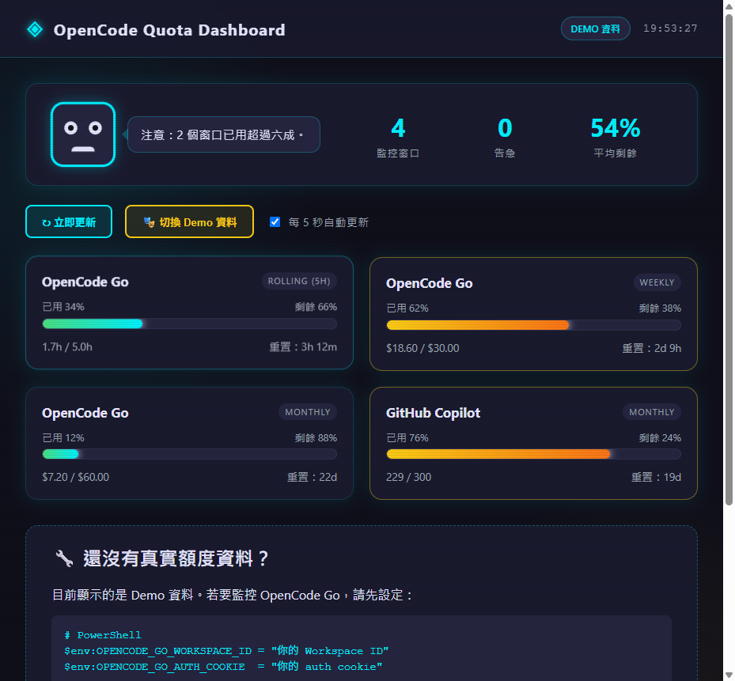

# OpenCode Quota Dashboard

AgentMove 風格的本地額度儀表板 MVP，監控 OpenCode Go / Copilot / OpenAI 等提供者的每日/每週/每月/rolling 額度。



## 快速開始（一鍵啟動）

```powershell
# 進入工具目錄
cd tools/opencode-quota-dashboard

# 執行一鍵啟動腳本（第一次會詢問 cookie，之後自動讀取加密儲存的 cookie）
.\start-dashboard.ps1
```

腳本會：
1. 自動設定 `OPENCODE_GO_WORKSPACE_ID` 與 `OPENCODE_GO_AUTH_COOKIE`
2. 背景啟動 Node server
3. 自動開啟瀏覽器到 http://localhost:3334

## 手動啟動（進階）

```powershell
$env:OPENCODE_GO_WORKSPACE_ID = "wrk_01KSKPTZKA441ARG8TK8V0YR1Y"
$env:OPENCODE_GO_AUTH_COOKIE  = "你的 auth cookie"
node server.js
```

## 取得 auth cookie

1. 登入 [opencode.ai](https://opencode.ai)
2. 開啟瀏覽器 DevTools → **Application** → **Storage → Cookies** → `https://opencode.ai`
3. 找到 `auth` cookie，複製 **Value** 整串
4. 貼到 `start-dashboard.ps1` 提示中

## 命令列選項

```powershell
node server.js --port 8080    # 自訂 port
node server.js --mock         # 強制使用 Demo 資料
```

## API

- `GET /api/health` - 健康檢查
- `GET /api/quota` - 額度資料 JSON
- `GET /api/quota?mock=1` - 強制 Demo 資料

## 資料來源

後端呼叫 `npx @slkiser/opencode-quota show` 取得額度，並解析文字輸出為 JSON。若尚未設定任何 provider，會自動退回 Demo 資料並顯示設定提示。

## 技術棧

- Node.js 內建 `http` server（零額外相依）
- 純 HTML / CSS / JS 前端
- 像素風視覺 + 進度條 + 吉祥物狀態
